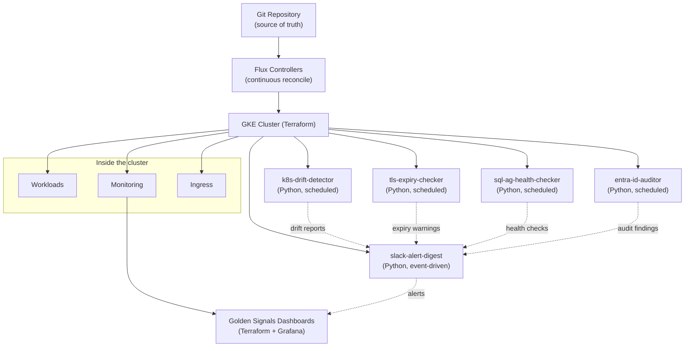

# Platform Engineering Toolkit

A reference implementation of a modern, GitOps-driven platform stack on Google Cloud — built to reflect how I approach infrastructure work: secure by default, automated where it counts, and easy for other engineers to reason about.

This repo brings together four pieces that are usually scattered across separate projects:

1. **[`terraform-gke/`](./terraform-gke)** — Infrastructure as Code for a production-grade GKE cluster
2. **[`gitops-flux/`](./gitops-flux)** — A Flux-based GitOps structure for continuous deployment to that cluster
3. **[`observability-dashboards/`](./observability-dashboards)** — Dashboard-as-code: a Golden Signals Grafana dashboard and matching Prometheus alert rules, defined in Terraform
4. **[`tools/`](./tools)** — Five small Python utilities that solve real operational problems: configuration drift detection, alert-noise reduction, TLS certificate expiry monitoring, SQL Server Always On AG health checking, and Entra ID security auditing

## Why this stack

I've spent most of my recent career operating Azure-based, PCI DSS-regulated infrastructure — Kubernetes (AKS), Terraform, GitOps pipelines, and observability stacks built on Grafana Cloud. This repo is a deliberate exercise in applying those same patterns to GCP, since that's where I'm actively deepening my expertise.

The goal isn't to reinvent any of these tools — it's to show how they fit together in a coherent, opinionated platform: Terraform provisions the cluster, Flux continuously reconciles what's running on it against Git, and small focused tools fill the operational gaps that off-the-shelf software doesn't cover.

## Architecture at a glance



*(If you're viewing this on GitHub, the diagram above renders automatically. Viewing the raw markdown elsewhere — Mermaid diagrams need a renderer that supports them, such as GitHub, GitLab, or the Mermaid Live Editor.)*

## Repo structure

```
platform-engineering-toolkit/
├── terraform-gke/           # GKE cluster IaC module
├── gitops-flux/              # Flux GitOps repo structure
│   ├── clusters/production/  # Cluster-level Flux config
│   └── apps/                 # Application manifests (base + overlays)
├── observability-dashboards/ # Golden Signals dashboard-as-code (Terraform + Grafana)
└── tools/
    ├── k8s-drift-detector/    # Detects drift between desired & live cluster state
    ├── slack-alert-digest/    # Aggregates noisy alerts into a single digest
    ├── tls-expiry-checker/    # Monitors TLS certificate expiry across hosts
    ├── sql-ag-health-checker/ # Checks SQL Server Always On AG replica/database health
    └── entra-id-auditor/      # Audits Entra ID for stale principals, privileged roles, expiring credentials
```

Each subdirectory has its own README with setup and usage instructions.

## Background

I'm a Senior DevOps/Platform Engineer with experience spanning Kubernetes, GitOps, Terraform, Python automation, and observability — including leading a production cutover of a PCI DSS-regulated payment platform to Azure, modernizing 100+ CI/CD pipelines, and building automation that eliminated manual runbook execution for routine operational tasks.

This repo represents how I'd approach building a platform team's foundation: solid IaC, GitOps discipline, and small tools that remove toil rather than add to it.
